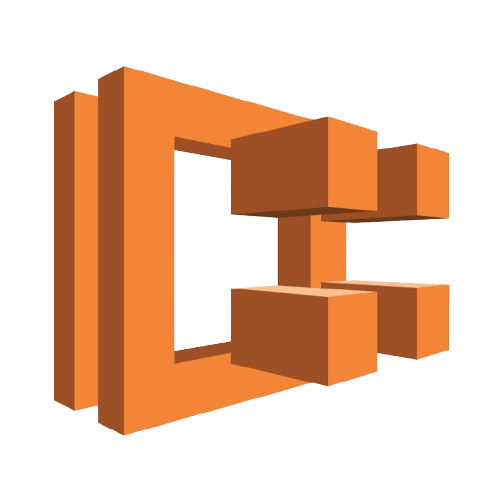
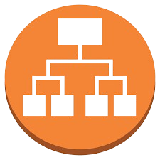
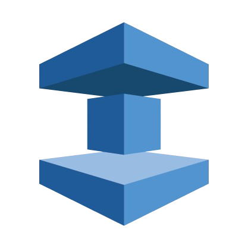
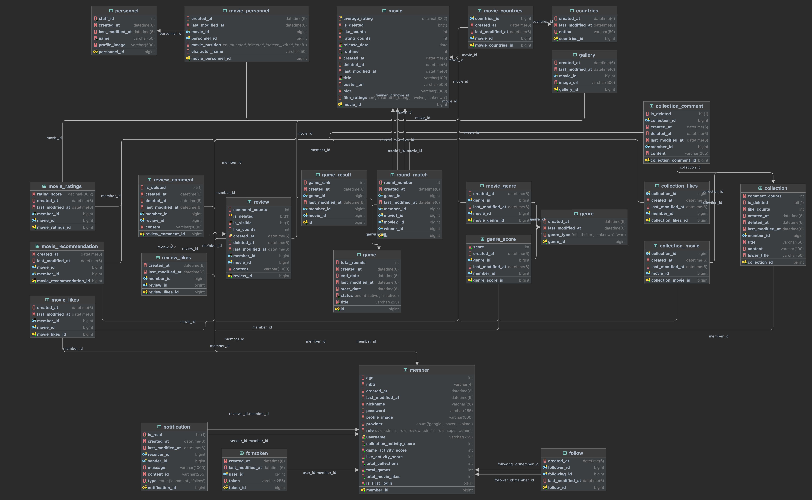

# FILMEET-BACKEND

## 목차

1. [**서비스 소개**](#1)
2. [**기술적 달성**](#2)
3. [**프로젝트 일정**](#3)
4. [**팀원 소개**](#4)
5. [**기술 스택**](#5)
6. [**ER Diagram**](#6)
7. [**시스템 아키텍처**](#7)
8. [**주요 기능**](#8)

## 💡 서비스 소개

### FILMEET

> **Filmeet**는 유저가 자신의 영화 취향을 발견하고 즐거운 경험을 할 수 있도록 돕는 **영화 추천 플랫폼**입니다.

### 🎯 문제 정의

많은 사람들이 방대한 영화 선택지 속에서 **결정 피로**를 느끼며, 자신의 영화 취향을 명확히 알지 못합니다.  
이로 인해 영화를 선택하는 과정에서 어려움을 겪고, 영화 감상의 즐거움을 충분히 누리지 못합니다.

### 🛠️ 해결 방안: 디스커버리 커머스의 도입

**디스커버리 커머스**는 유튜브, 넷플릭스와 같은 플랫폼에서 유저가 **계획에 없던 콘텐츠를 즐겁게 발견**하는 트렌드입니다.  
Filmeet은 이를 영화 추천 서비스에 적용하여, 유저가 무심코 스크롤하다가 마음에 드는 영화를 발견하는 경험을 제공합니다.

- **행동 데이터 기반의 개인화된 알고리즘**
- **유저 활동과 엔터테인먼트 요소**를 활용한 추천
- **개인 맞춤형 콘텐츠**로 새로운 영화 소비 경험 제공

### 🚀 핵심 가치

1. **즐거운 영화 추천 경험**
    - 유저의 행동 데이터를 분석하여 취향에 맞는 영화를 추천합니다.
    - 엔터테인먼트 요소를 통해 유저의 **참여도와 리텐션**을 극대화합니다.

2. **새로운 영화 소비 모델 제시**
    - 단순 추천 서비스를 넘어, **발견의 즐거움**을 제공합니다.

3. **지속 가능한 플랫폼**
    - 확보된 트래픽을 기반으로 **광고와 상업화 기능**을 추가하여 플랫폼의 성장을 도모합니다.

Filmeet은 유저 중심의 혁신적인 영화 추천 경험을 제공하며, 모두가 자신의 취향을 더 쉽게 발견할 수 있도록 돕는 것을 목표로 합니다.

## 📈 기술적 달성

### 1. 개인화된 사용자 경험 극대화

Filmeet에서는 사용자에게 더 정확하고 맞춤화된 추천을 제공하여 '나를 위한 서비스'처럼 느껴지는 개인화된 경험을 제공하기 위해 **하이브리드 추천 시스템**을 도입했습니다.

- **콘텐츠 기반 추천**  
  사용자가 선호하는 영화의 장르나 특성을 분석하여 유사한 콘텐츠를 추천합니다.  
  예를 들어, 사용자가 액션 영화에 많이 반응했다면 비슷한 장르의 영화를 추천합니다.

- **유사 사용자 기반 추천**  
  나와 관심사가 비슷한 사용자들을 분석하고, 그들이 선호하는 영화를 추천합니다.  
  이를 통해 다양한 시각을 반영하고 더 폭넓은 추천 결과를 제공합니다.

- **하이브리드 추천의 장점**  
  두 가지 방식을 결합해 각각의 단점을 보완하고 추천의 정확도와 다양성을 극대화했습니다.
    - 콘텐츠 기반 추천: 사용자의 선호 패턴을 바탕으로 추천하지만, 취향이 고정적이거나 콘텐츠의 특성이 명확하지 않은 경우 한계가 발생.
    - 유사 사용자 기반 추천: 비슷한 사용자들의 데이터를 활용하지만, 데이터가 부족하거나 특정 사용자 그룹의 편향된 추천 가능성 존재.
    - 하이브리드 방식: 두 추천 방식의 강점을 결합하여 정확성과 다양성을 동시에 반영합니다.

- **결과**  
  Filmeet은 하이브리드 추천 시스템을 통해 사용자에게 더 빠르고 정확한 영화 추천을 제공하며, 영화 탐색의 편의성을 높이고 서비스 만족도를 향상시킬 수 있습니다.

---

### 2. OAuth 2.0 한계를 뛰어넘어 OIDC 도입

**OIDC(OpenID Connect)**는 OAuth 2.0 위에 **ID 토큰을 추가**하여 사용자의 신원을 검증할 수 있도록 확장된 인증 프로토콜입니다.  
Filmeet에서는 OAuth 2.0의 한계를 보완하기 위해 OIDC를 도입하여 사용자 인증과 권한 부여를 동시에 처리합니다.

- **OAuth 2.0의 한계**  
  OAuth 2.0은 자원 접근 권한 위주의 프로토콜로, 사용자 인증(Authentication)에는 부족한 점이 존재합니다.  
  이는 사용자 식별에 필요한 정보(사용자 ID, 로그인 세션 등)를 명확히 제공하지 못하기 때문입니다.

- **OIDC의 이점**
    1. **ID 토큰 기반 인증**: 사용자 로그인 상태 및 식별 정보를 클라이언트 애플리케이션에 안전하게 제공합니다.
    2. **확장성**: OAuth 2.0과의 호환성을 유지하면서 추가 기능을 제공하여 기존 시스템과 쉽게 통합됩니다.
    3. **보안 강화**: OpenID Provider(OP)와의 통신에서 암호화된 JWT 토큰을 사용하여 인증 및 권한 부여를 더욱 안전하게 처리합니다.

- **Filmeet에서의 OIDC 활용**  
  Filmeet은 OIDC 도입을 통해 **사용자 경험을 개인화**하고, **보안 수준을 강화**하여 보다 신뢰할 수 있는 서비스 환경을 제공합니다.

- **OIDC에 대한 자세한 내용은 [여기](https://elated-tortoise-2aa.notion.site/OIDC-OpenID-Connect-1607781b0e0a806c9303da2cf03e9107)
  에서 확인할 수 있습니다.**

---

### 3. Uplus 기준에 부합하는 0.1s 달성하기

Filmeet에서는 **사용자 경험(UX)을 극대화**하기 위해, **응답 속도 0.1초**라는 목표를 설정하고 이를 실현하기 위한 다양한 기술적 최적화를 적용합니다.

- **목표의 중요성**  
  연구에 따르면, 웹 애플리케이션의 응답 시간이 0.1초 이하일 경우 사용자는 **즉각적 반응**을 느끼며, 이는 UX와 사용자 리텐션을 크게 향상시킵니다.  
  Uplus의 기준인 0.1초는 이를 위한 **최상의 성능 기준**입니다.

- **달성 전략**
    1. **캐싱(Caching)**
        - 자주 요청되는 데이터를 **Redis**와 같은 메모리 기반 캐시 시스템으로 처리하여 응답 속도를 단축합니다.
    2. **비동기 처리(Asynchronous Processing)**
        - CPU 집약적 작업이나 대규모 데이터 처리 작업을 비동기로 처리하여 서버 응답 속도를 최적화합니다.
    3. **쿼리 최적화**
        - 데이터베이스 쿼리를 분석하여 **인덱스 추가**, **쿼리 리팩토링** 등으로 I/O 병목 현상을 제거합니다.
    4. **API 게이트웨이 최적화**
        - API 요청을 효율적으로 라우팅하며, 불필요한 요청을 최소화하기 위한 설계를 도입합니다.

- **Filmeet에서의 성과**  
  Filmeet은 이러한 최적화를 통해 사용자에게 **즉각적이고 빠른 응답**을 제공하며, 안정적이고 쾌적한 경험을 제공합니다.

- **Uplus 기준 0.1s 응답 목표에 대한 자세한 내용은 [여기](https://jun10920.tistory.com/48)에서 확인할 수 있습니다.**

## 📆 프로젝트 일정

### 24.11.12 ~ 24.12.19

- 기획 및 설계 : 24.11.12 ~ 24.11.18
- 프로젝트 구현 : 24.11.19 ~ 24.12.09
- 고도화 : 24.12.09 ~ 24.12.15
- 버그 수정 및 산출물 정리 : 24.12.15

 

## 👪 팀원 소개

<table>
    <tr>
        <td height="140px" align="center"> <a href="https://github.com/chakunyoung">
                😄 박준형  (Back-End) </a>  </td>
        <td height="140px" align="center"> <a href="https://github.com/DeadBBall">
                😁 안재진  (Back-End) </a>  </td>
        <td height="140px" align="center"> <a href="https://github.com/eastsage">
                😆 이동현  (Back-End) </a>  </td>
    </tr>
</table>

 

## 🛠️ 기술 스택

|                Spring Boot                 |                 JPA                 |             Spring Security              |             Spring Batch              |                 MySQL                 |                 Redis                 |                 Querydsl                 |               AWS ECS               |               AWS EC2               |               AWS RDS               |               AWS ALB               |              AWS Elastic Cache               |               AWS Amplify               |                 Pinpoint                 |
|:------------------------------------------:|:-----------------------------------:|:----------------------------------------:|:-------------------------------------:|:-------------------------------------:|:-------------------------------------:|:----------------------------------------:|:-----------------------------------:|:-----------------------------------:|:-----------------------------------:|:-----------------------------------:|:--------------------------------------------:|:---------------------------------------:|:----------------------------------------:|
|  |  |  |  |  |  |  |  |  |  |  |  |  |  |

 

## 🏢 ER Diagram

 

## 🗂️ 시스템 아키텍처

 

## 💻 주요 기능

### 기능1
